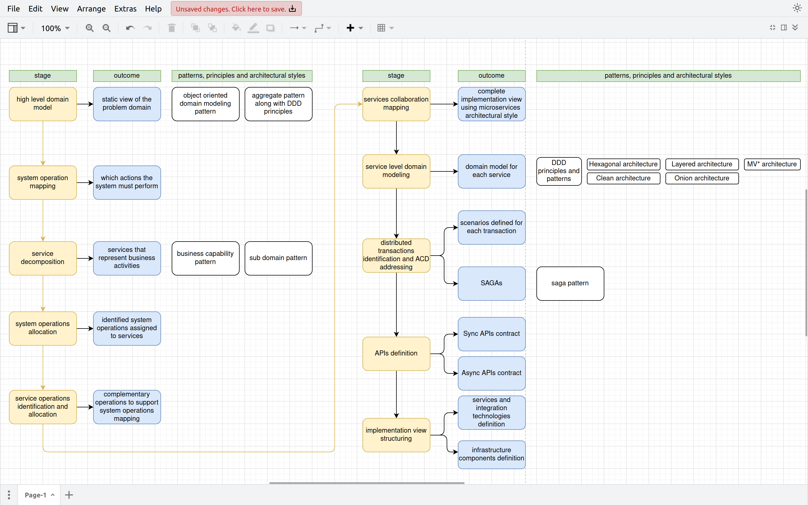

# microservices-archictecture-breakdown-process-guide
A guide for identifying microservices into your architecture aligned with Martin Fowler's principles, conway's law, lehman's laws, SOLID and Package Principles and domain driven design.

This guide was built with the help of Chat GPT 3.5. Not all the credit is mine. I just asked a few questions.

## microservices architecture construction stages

## References
- ChatGPT for sure
- Martin Fowler microservices guide: https://martinfowler.com/microservices/
- Leandro Conca de Luccia's playlist on Conway's Law, team topologies and DDD: https://www.youtube.com/watch?v=5iz-dAEsOkM&list=PL0GiTTuMnt3aJj88kZQJGGamGRVxUsFGw
- Applying UML and Patterns: An Introduction to Object-Oriented Analysis and Design and Iterative Development, Third Edition By Craig Larman
- Agile Principles, Patterns, and Practices in C# By Robert C. Martin
- Clean Code By Robert C. Martin
- Clean Architecture By Robert C. Martin
